

  

<h1 align="center">MADBOOK: Kitap Aşıkları ve Sosyal Bağlar 📚</h1>

  
  
  
  

  MADBOOK, kitap tutkunları için bir sosyal cennet! 📖 Django ile geliştirilmiş bu platformda, kitapları okuyup yorum yapabilir, yıldız verebilir, arkadaşlarınızla mesajlaşabilir ve şikayet bildirebilirsiniz. Her 1 dakikada gözlerinizi koruyan dinlenme modalıyla, hem sosyal hem sağlıklı! 😎 Railway’de PostgreSQL ile çalışıyor, reCAPTCHA ile güvenli. Kanzi tarafından 💪 sevgiyle kodlandı!

## 🚀 Özellikler
- 📖 **Kitap Detayları**: Başlık, yazar, özet ve daha fazlasını keşfedin.
- ⭐ **Yıldız Derecelendirme**: Kitaplara 1’den 5’e yıldız verin.
- 💬 **Yorum Sistemi**: Düşüncelerinizi paylaşın, diğer okuyucularla tartışın.
- ⏰ **Dinlenme Modalı**: Her 1 dakikada göz sağlığınız için mola uyarısı.
- 🔒 **reCAPTCHA Güvenliği**: Yorum ve formlarınız spam’den korunuyor.
- 📩 **Mesajlaşma**: Okunmamış mesaj bildirimleriyle sohbet edin.
- 🤝 **Arkadaşlık İstekleri**: Yeni kitap dostları edinin.
- 🚨 **Şikayet Sistemi**: Çözülmemiş şikayetleri takip edin.
- 🛠️ **Django Admin Paneli**: Kolay içerik yönetimi.
- ☁️ **Railway Deployment**: PostgreSQL ile hızlı ve güvenilir.

## 📸 Ekran Görüntüleri
| Anasayfa 1           | Anasayfa 2           | Anasayfa 3           | Detay Sayfası 1      | Detay Sayfası 2      | Detay Sayfası 3      |
|-----------------------|-----------------------|-----------------------|-----------------------|-----------------------|-----------------------|
| 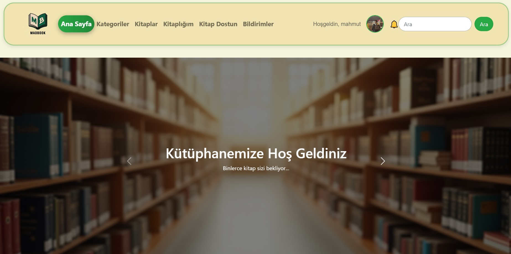 | 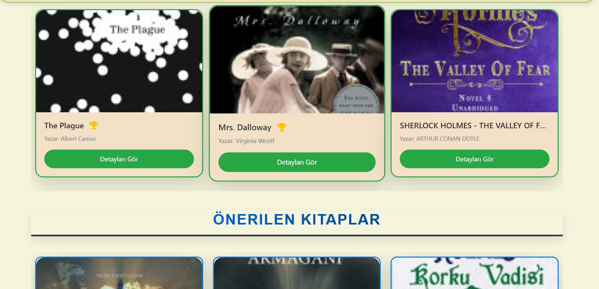 | 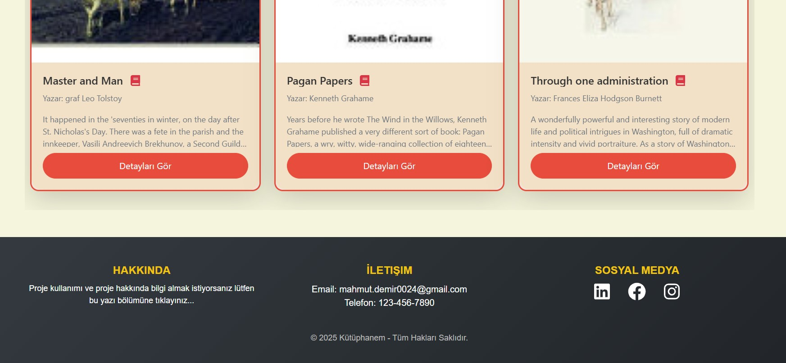 |  | 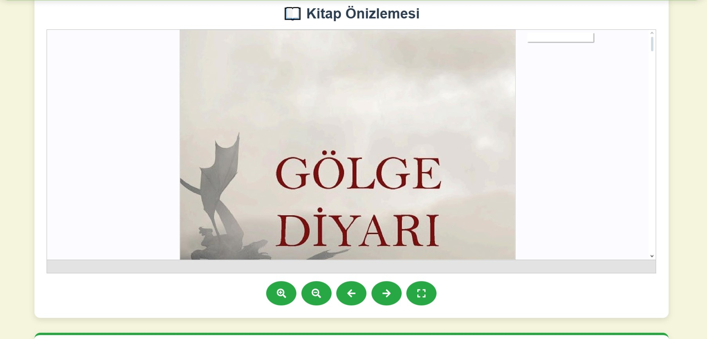 | 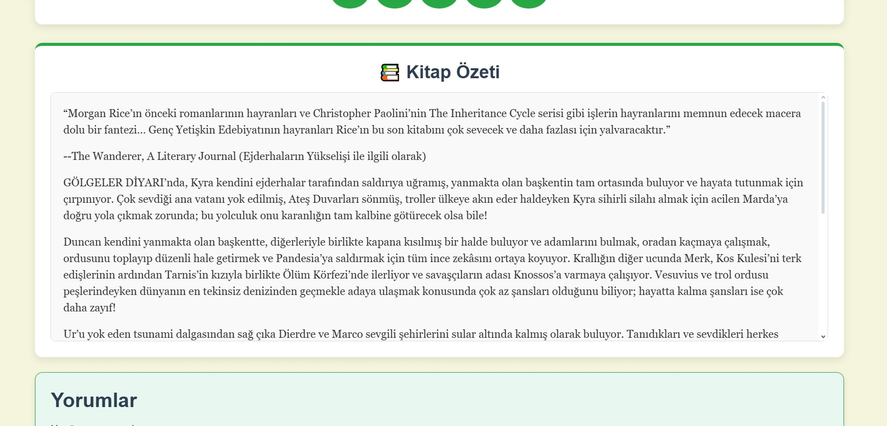 |

| Detay Sayfası 4      | Chatbot 1            | Chatbot 2            | Kategoriler          | Kategoriye Göre Kitaplar | Kitaplar Sayfası     |
|-----------------------|-----------------------|-----------------------|-----------------------|-----------------------|-----------------------|
| 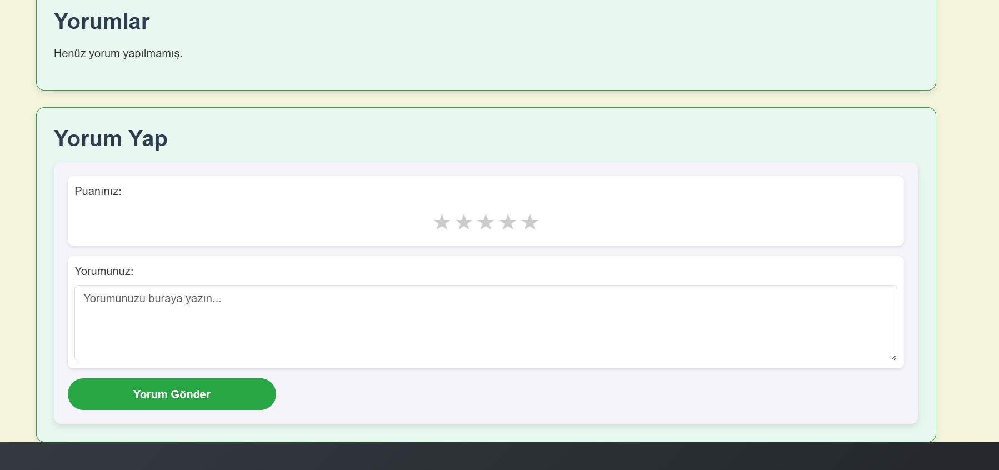 | 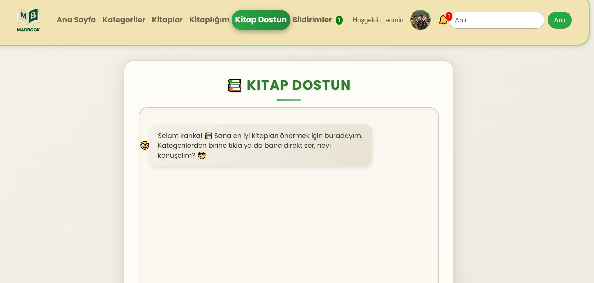 | 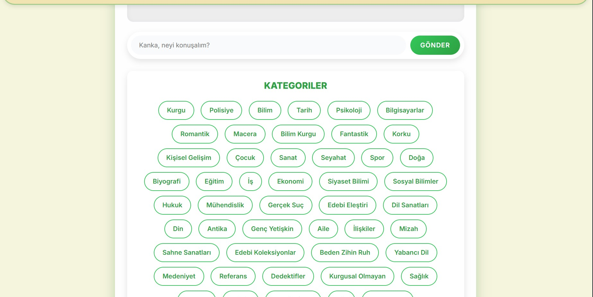 | 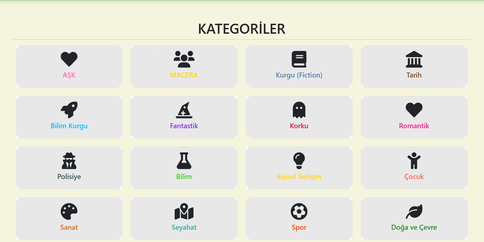 | 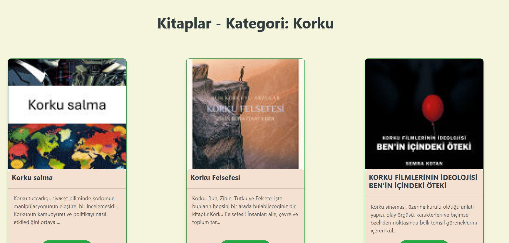 | 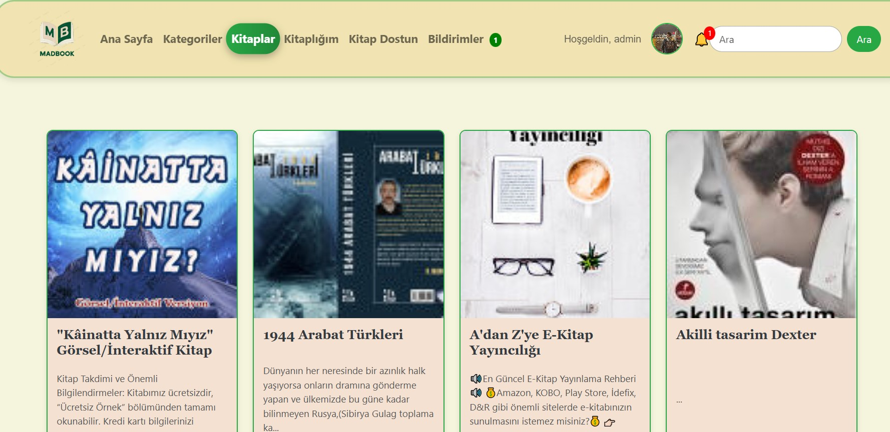 |

| Kitaplık Sayfası     | Profil 1             | Profil 2             | Şikayet Sayfası      | Animasyon (GIF)      | Trans 1              |
|-----------------------|-----------------------|-----------------------|-----------------------|-----------------------|-----------------------|
| 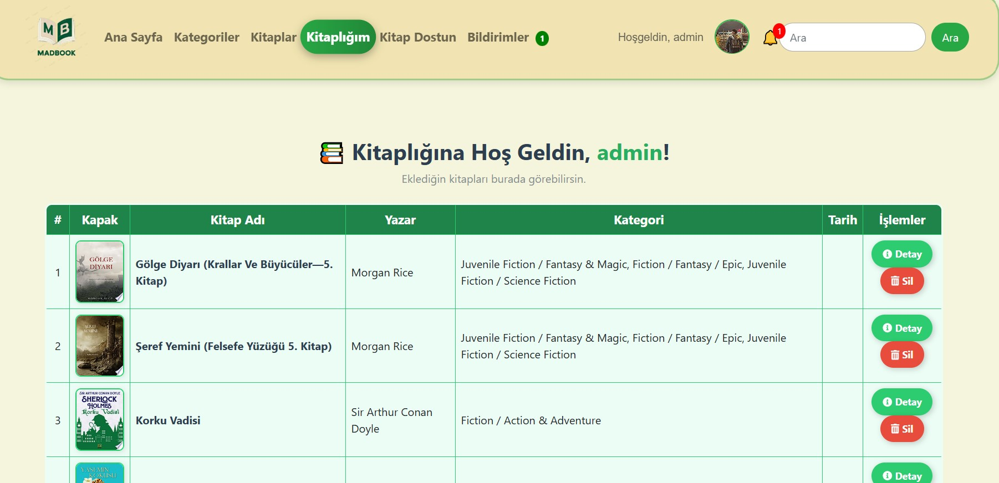 | 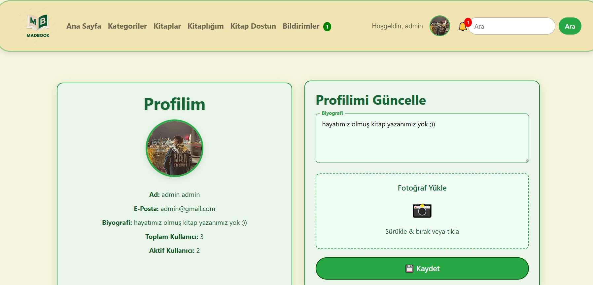 | 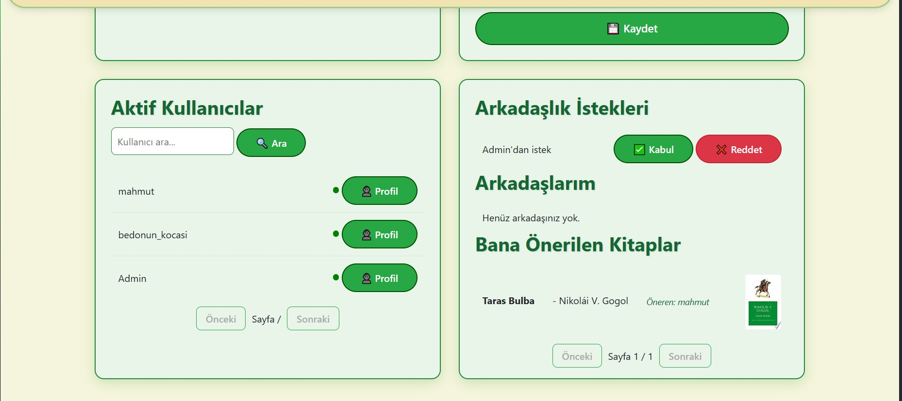 | 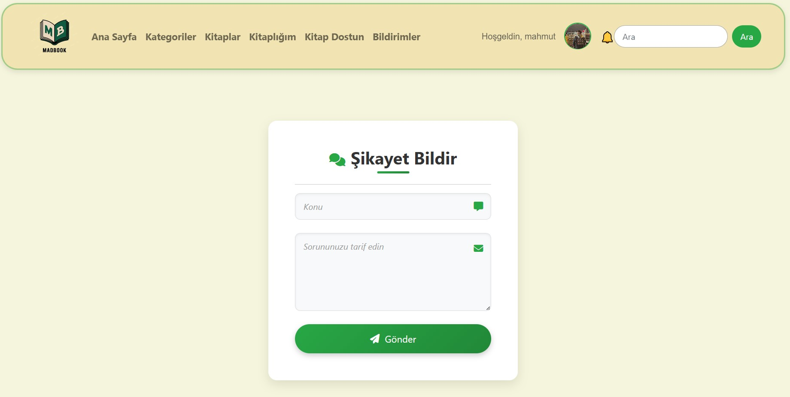 |  | 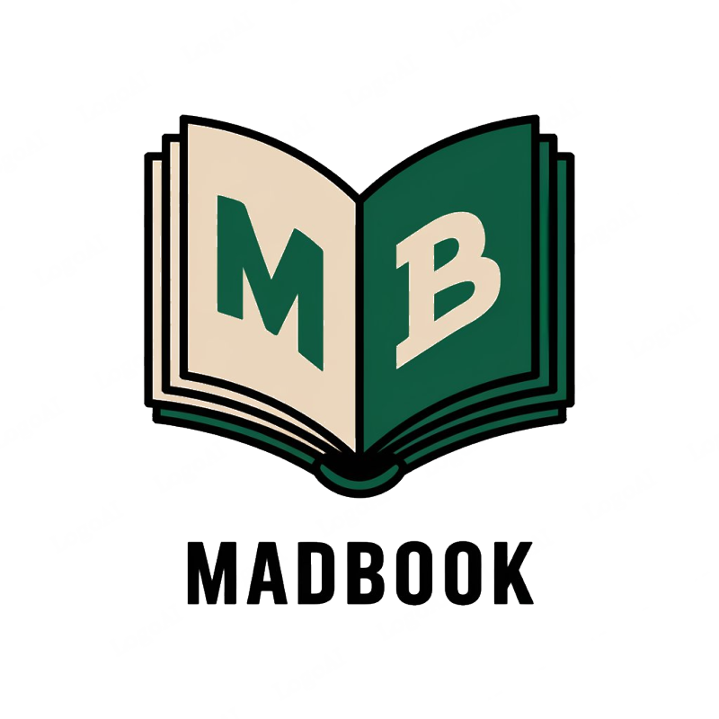 |

## 🔗 Canlı Demo
MADBOOK’u canlı görmek ister misiniz? Hemen ziyaret edin:  
👉 [web-production-c8a3.up.railway.app/library/](https://web-production-c8a3.up.railway.app/library/)

## 📬 İletişim
- **GitHub**: [mahmutdmrr0](https://github.com/mahmutdmrr0)
- **E-posta**: mahmut.demir0024@gmail.com

