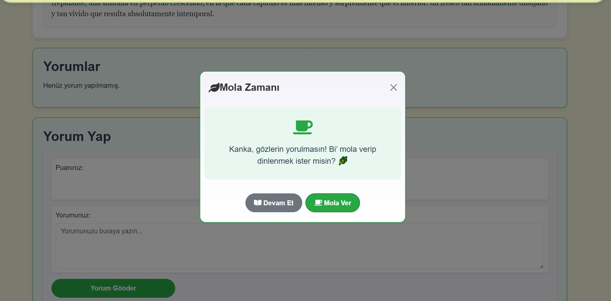

  

<h1 align="center">MADBOOK: Kitap Aşıkları ve Sosyal Bağlar 📚</h1>

  
  
  
  

  MADBOOK, kitap tutkunları için bir sosyal cennet! 📖 Django ile geliştirilmiş bu platformda, kitapları okuyup yorum yapabilir, yıldız verebilir, arkadaşlarınızla mesajlaşabilir ve şikayet bildirebilirsiniz. Her 1 dakikada gözlerinizi koruyan dinlenme modalıyla, hem sosyal hem sağlıklı! Railway’de PostgreSQL ile çalışıyor, reCAPTCHA ile güvenli.

---

## 🚀 Özellikler

- 📖 **Kitap Detayları**: Başlık, yazar, özet ve daha fazlası.
- ⭐ **Yıldız Derecelendirme**: Kitaplara puan ver.
- 💬 **Yorum Sistemi**: Yorum yap, tartışmalara katıl.
- ⏰ **Dinlenme Modalı**: Göz sağlığınız için mola uyarısı.
- 🔒 **reCAPTCHA**: Spam koruması.
- 📩 **Mesajlaşma**: Okunmamış mesaj bildirimleri.
- 🤝 **Arkadaşlık Sistemi**: Yeni kitap dostları edin.
- 🚨 **Şikayet Paneli**: Bildirim ve yönetim ekranı.
- 🛠️ **Admin Panel**: İçerik kontrolü.
- ☁️ **Railway Deployment**: Hızlı ve güvenilir sunum.

---

## 📸 Ekran Görüntüleri

### 🏠 Anasayfa

| Anasayfa 1 | Anasayfa 2 | Anasayfa 3 |
|-----------|------------|------------|
|  |  |  |

---

### 📖 Kitap Detayları

| Detay 1 | Detay 2 | Detay 3 |
|--------|---------|---------|
|  |  |  |

| Detay 4 | Kitaplar Sayfası | Kitaplık |
|--------|-------------------|----------|
|  |  |  |

---

### 💬 Chatbot & Kategoriler

| Chatbot 1 | Chatbot 2 | Kategoriler | Kategoriye Göre Liste |
|-----------|-----------|-------------|------------------------|
|  |  |  |  |

---

### 👤 Profil ve Sosyal

| Profil 1 | Profil 2 | Arkadaşlar 1 | Arkadaşlar 2 |
|----------|----------|--------------|--------------|
|  |  |  |  |

| Arkadaşlar 3 | Arkadaşlar 4 | Sohbetler |
|--------------|--------------|-----------|
|  |  |  |

---

### 🛠️ Yönetim & Diğer

| Şikayet Sayfası | Admin Şikayet | Arama | Navbar |
|-----------------|----------------|-------|--------|
|  |  |  |  |

| Login | Register | Şifre Değiştir | Şifre Hatırlama |
|-------|----------|----------------|-----------------|
|  |  |  |  |

| Dinlenme Modül | Relax Sayfası | Hakkında Sayfası |
|----------------|---------------|------------------|
|  |  |  |

---

### 🎞️ Animasyon

  

---

## 🔗 Canlı Demo

**MADBOOK’u canlı görmek için tıklayın:**

👉 [web-production-c8a3.up.railway.app/library/](https://web-production-c8a3.up.railway.app/library/)

---

## 📬 İletişim

- **GitHub**: [mahmutdmrr0](https://github.com/mahmutdmrr0)  
- **E-posta**: [mahmut.demir0024@gmail.com](mailto:mahmut.demir0024@gmail.com)
