<p align="center">
  
</p>

<h1 align="center">MADBOOK: Kitap Aşıkları ve Sosyal Bağlar 📚</h1>

<p align="center">
  <a href="https://www.djangoproject.com/"></a>
  <a href="https://www.python.org/"></a>
  <a href="https://railway.app/"></a>
  <a href="https://www.postgresql.org/"></a>
</p>

<p align="center">
  MADBOOK, kitap tutkunları için bir sosyal cennet! 📖 Django ile geliştirilmiş bu platformda, kitapları okuyup yorum yapabilir, yıldız verebilir, arkadaşlarınızla mesajlaşabilir ve şikayet bildirebilirsiniz. Her 1 dakikada gözlerinizi koruyan dinlenme modalıyla, hem sosyal hem sağlıklı! Railway’de PostgreSQL ile çalışıyor, reCAPTCHA ile güvenli.
</p>

---

## 🚀 Özellikler

- 📖 **Kitap Detayları**: Başlık, yazar, özet ve daha fazlası.
- ⭐ **Yıldız Derecelendirme**: Kitaplara puan ver.
- 💬 **Yorum Sistemi**: Yorum yap, tartışmalara katıl.
- ⏰ **Dinlenme Modalı**: Göz sağlığınız için mola uyarısı.
- 🔒 **reCAPTCHA**: Spam koruması.
- 📩 **Mesajlaşma**: Okunmamış mesaj bildirimleri.
- 🤝 **Arkadaşlık Sistemi**: Yeni kitap dostları edin.
- 🚨 **Şikayet Paneli**: Bildirim ve yönetim ekranı.
- 🛠️ **Admin Panel**: İçerik kontrolü.
- ☁️ **Railway Deployment**: Hızlı ve güvenilir sunum.

---

## 📸 Ekran Görüntüleri

### 🏠 Anasayfa ve Navigasyon

| Anasayfa 1 | Anasayfa 2 | Navbar | Footer |
|------------|------------|--------|--------|
|  |  | 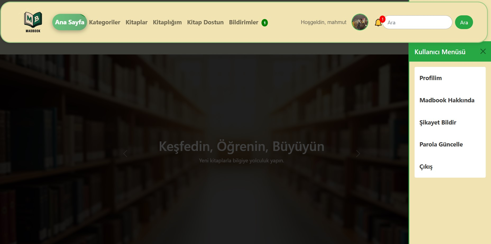 | 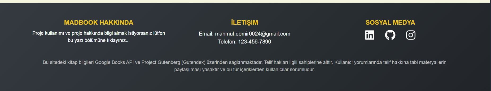 |

---

### 📚 Kitap ve Kategoriler

| Kategori Sayfası | Kitap Listesi | Kitaplık Sayfası | 
|------------------|---------------|------------------|
| 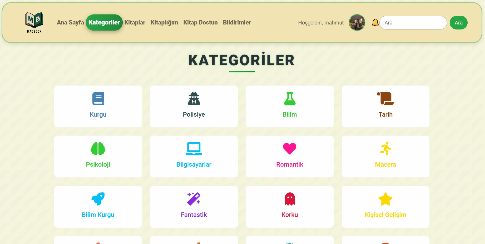 | 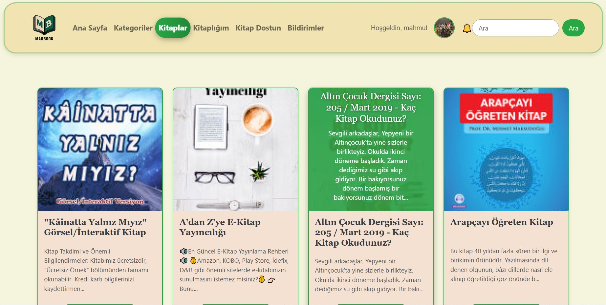 | 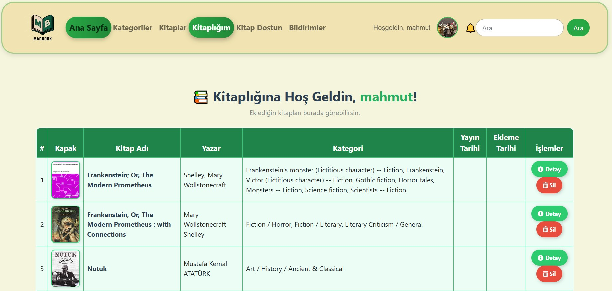 | 

---

### 📘 Kitap Detay Sayfası

| Detay Sayfası 1 | Detay Sayfası 2 | Detay Sayfası 3 | Detay Sayfası 4 |
|-----------------|-----------------|-----------------|-----------------|
|  |  |  |  |

---

### 🤖 Chatbot ve Arama

| Chatbot 1 | Chatbot 2 | Arama Sayfası |
|-----------|-----------|---------------|
|  |  | 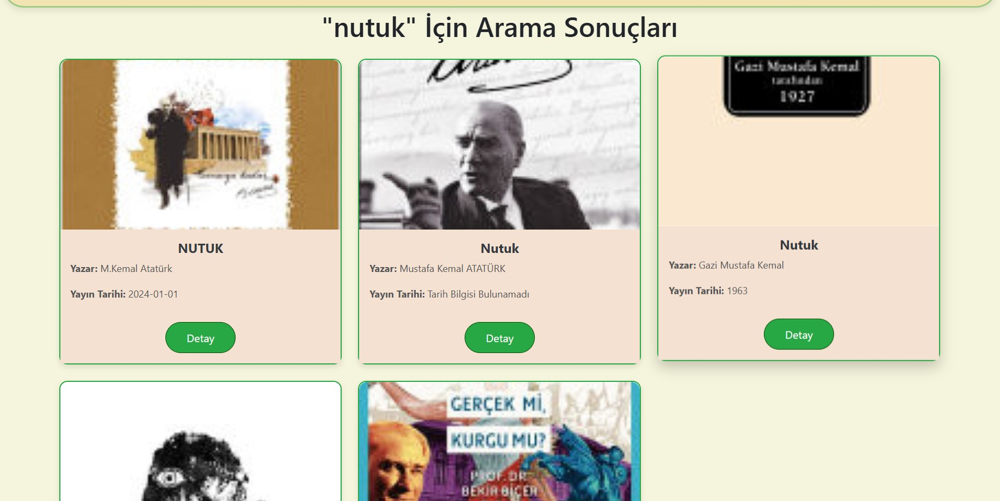 |

---

### 👤 Profil ve Arkadaşlık

| Profil 1 | Profil 2 | Arkadaşlar Sayfası 1 | Arkadaşlar Sayfası 2 |
|----------|----------|---------------------|----------------------|
|  |  | 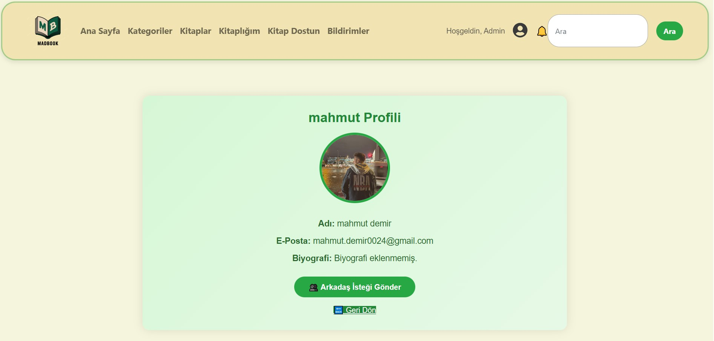 | 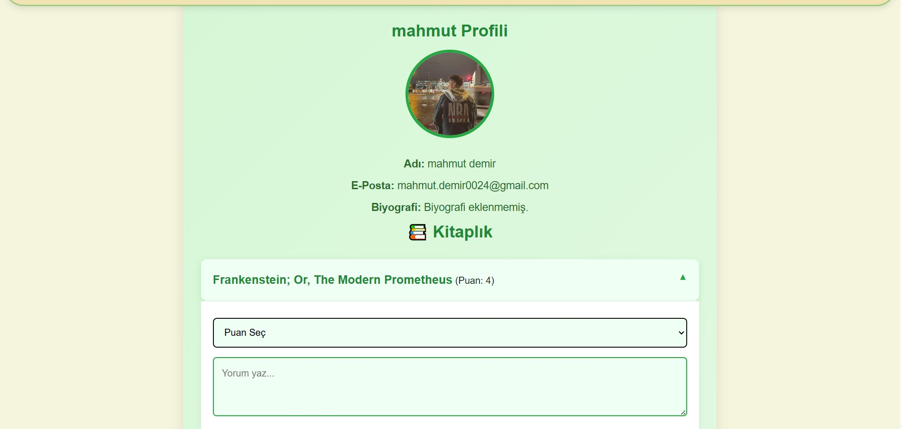 |

| Arkadaşlar Sayfası 3 | Arkadaşlar Sayfası 4 | Arkadaşlarla Sohbet |
|----------------------|----------------------|--------------------|
| 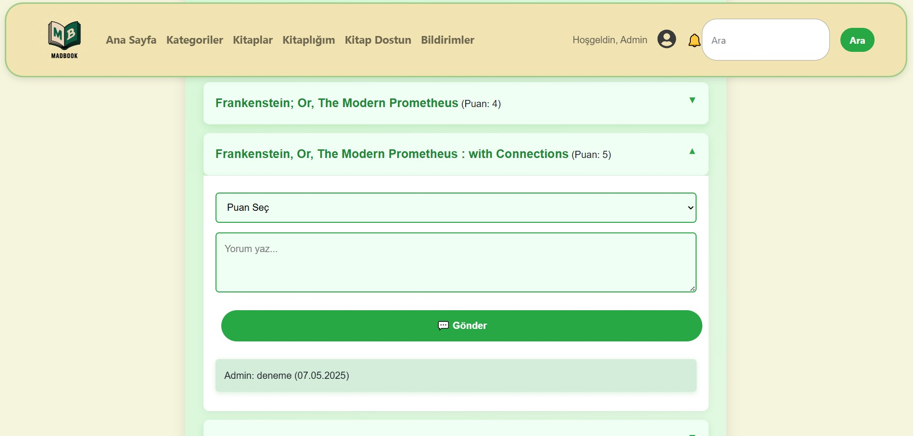 | 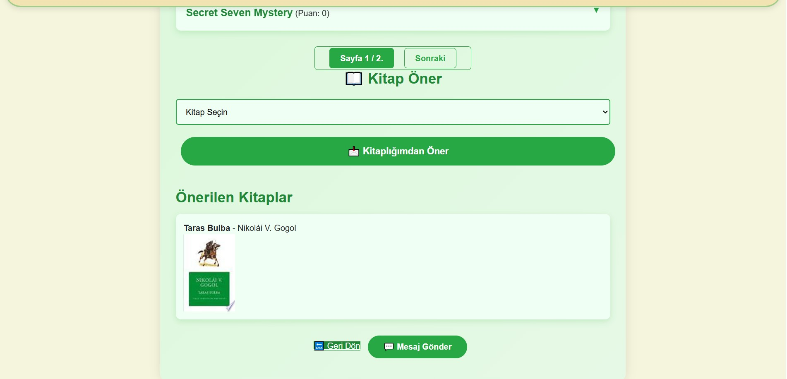 | 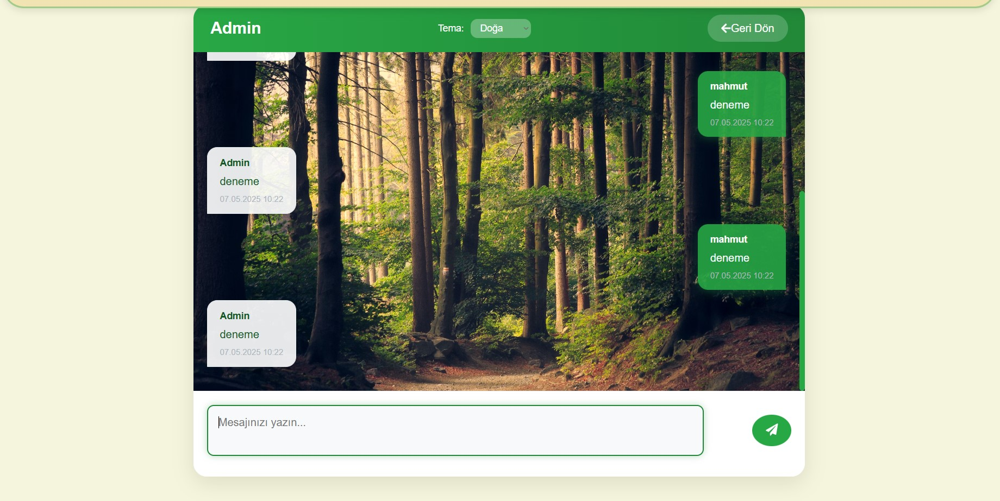 |

---

### 🔐 Giriş, Kayıt ve Şifre İşlemleri

| Giriş | Kayıt | Şifre Değiştirme | Şifremi Unuttum |
|-------|-------|------------------|-----------------|
| 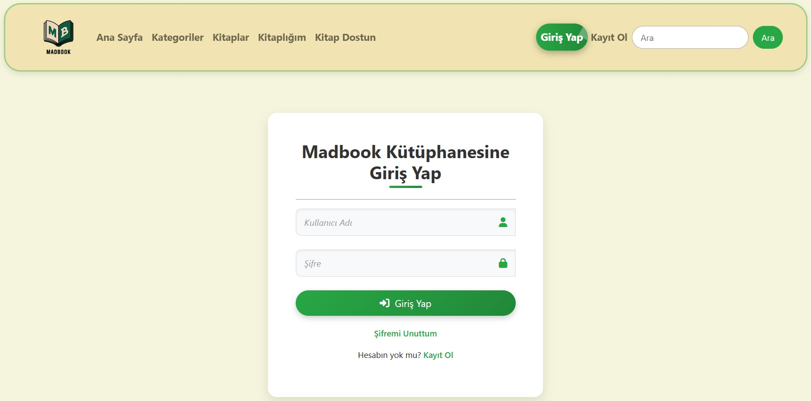 | 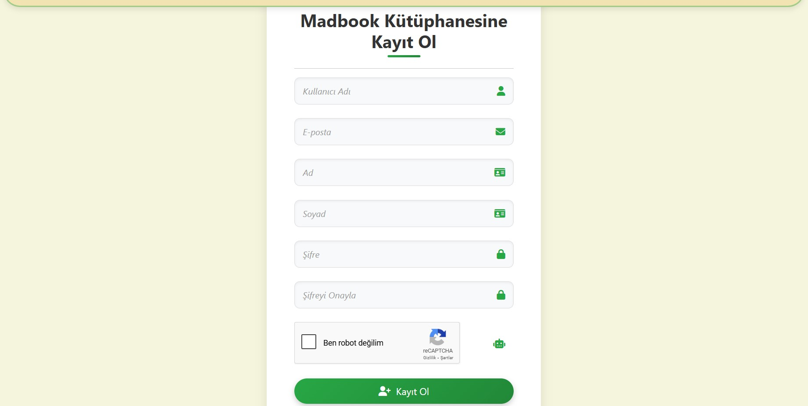 | 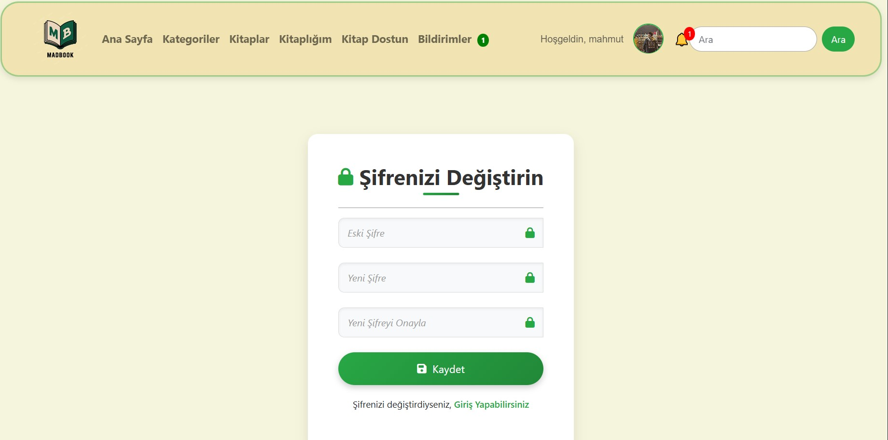 | 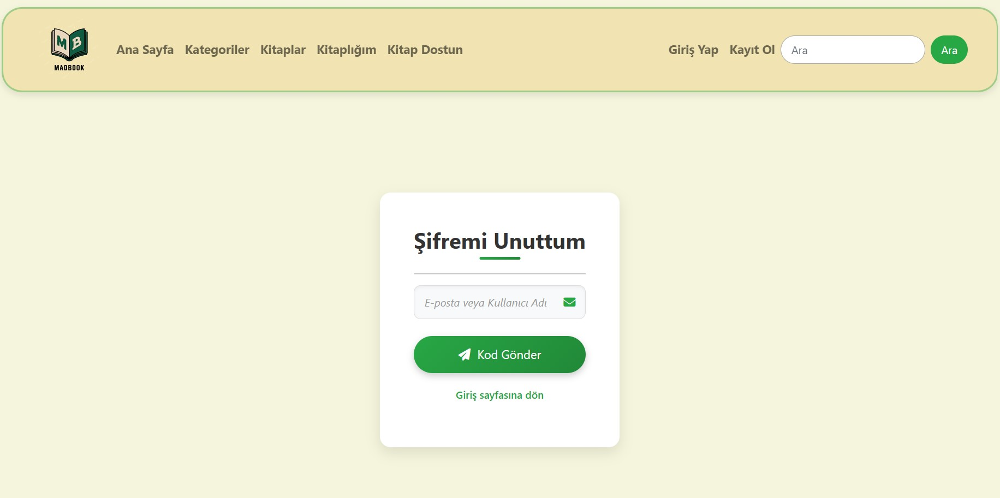 |

---

### ⚙️ Yönetici Paneli ve Şikayetler

| Admin Şikayet Paneli | Kullanıcı Şikayet Sayfası 
|----------------------|---------------------------
| 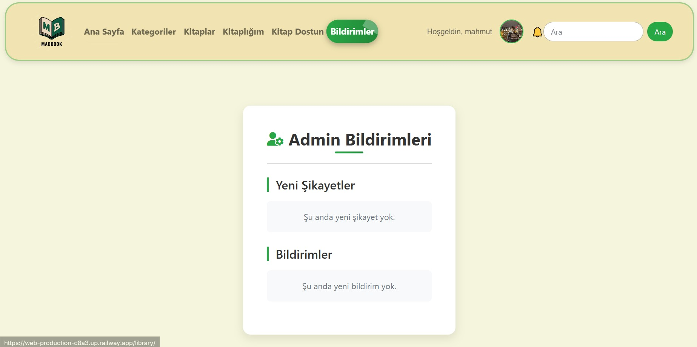 | 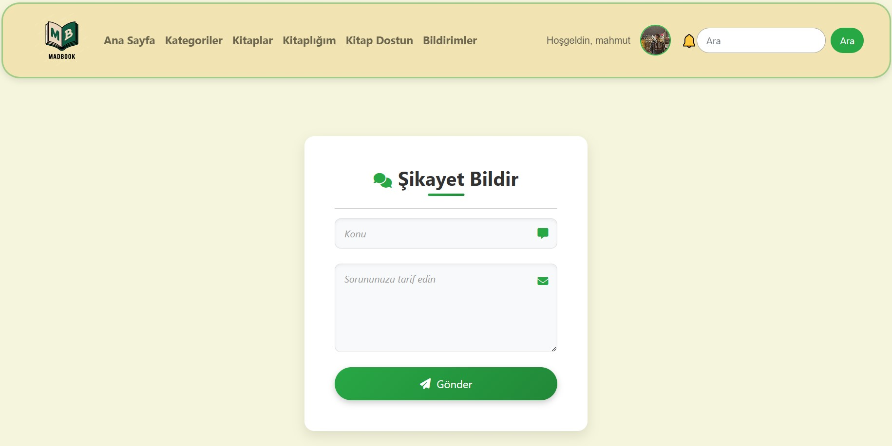 | 

---

### 🌿 Dinlenme Modülü ve Hakkında

| Dinlenme Modülü | Dinlenme Sayfası | Hakkında Sayfası |
|-----------------|------------------|------------------|
| 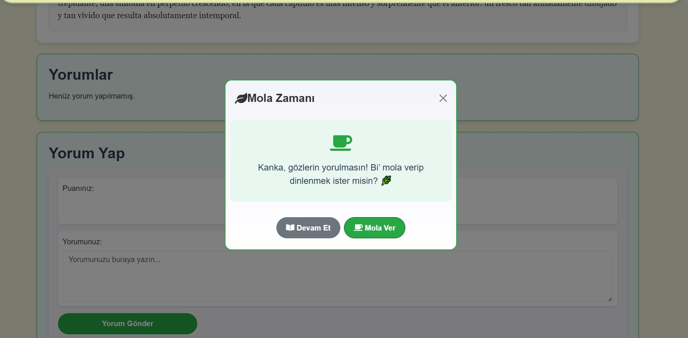 | 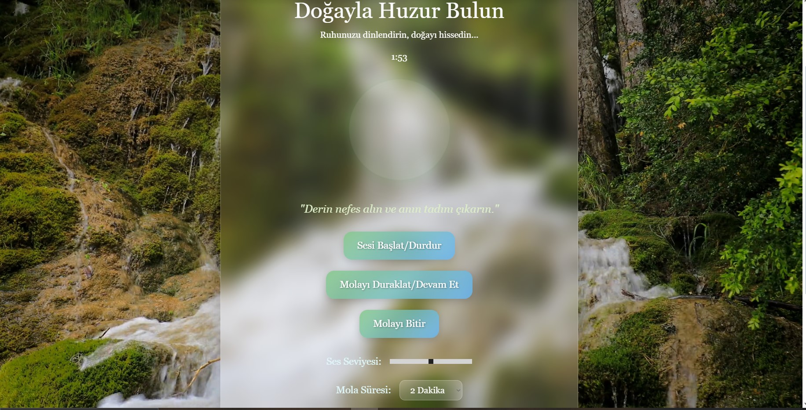 | 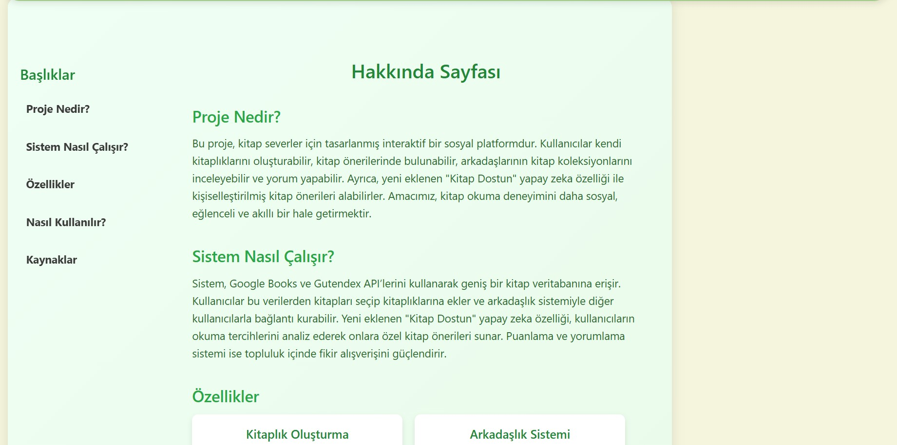 |

---

### 🎞️ Uygulama Animasyonu

<p align="center">
  
</p>

---

## 🔗 Canlı Demo

🎯 **Projeyi canlı inceleyin:**  
👉 [MADBOOK Canlı Site](https://web-production-c8a3.up.railway.app/library/)

---

## 💼 Kullanılan Teknolojiler

- Python 3.11
- Django 4.2
- PostgreSQL
- Railway
- HTML5, CSS3, JavaScript
- Bootstrap ve Tailwind
- Pillow, reCAPTCHA, Django Messages

---

## 🛠️ Kurulum

```bash
git clone https://github.com/mahmutdmrr0/madbook.git
cd madbook
pip install -r requirements.txt
python manage.py migrate
python manage.py runserver