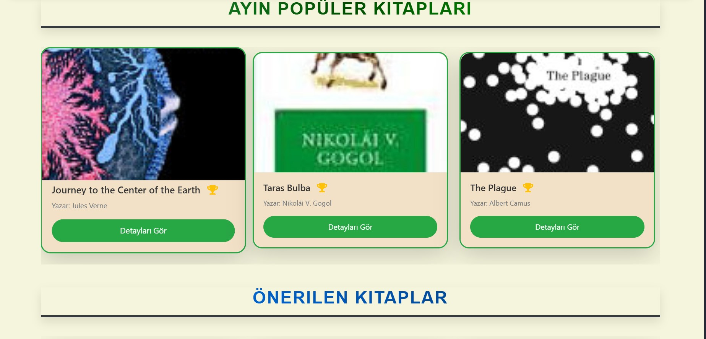
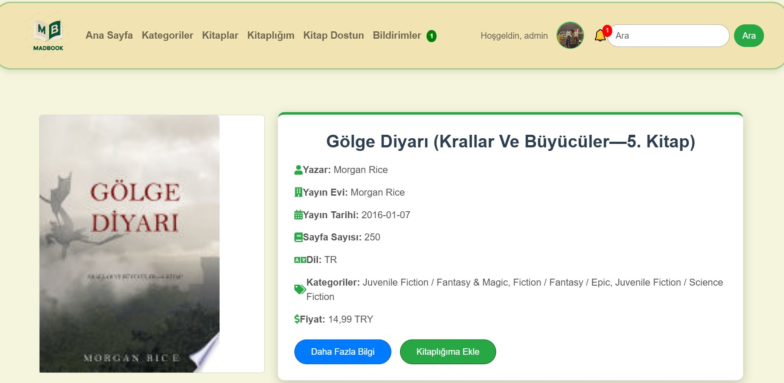

<p align="center">
  
</p>

<h1 align="center">MADBOOK: Kitap Aşıkları ve Sosyal Bağlar 📚</h1>

<p align="center">
  <a href="https://www.djangoproject.com/"></a>
  <a href="https://www.python.org/"></a>
  <a href="https://railway.app/"></a>
  <a href="https://www.postgresql.org/"></a>
</p>

<p align="center">
  <span style="color: #2c3e50; font-style: italic;">MADBOOK, kitap tutkunları için tasarlanmış bir sosyal platform! 📖 Django ile geliştirilen bu uygulama, kitapları inceleme, yorum yapma, yıldız verme, arkadaşlarla mesajlaşma ve şikayet bildirme gibi eşsiz özellikler sunar. Her 1 dakikada göz sağlığını koruyan dinlenme modalıyla hem sosyal hem sağlıklı bir deneyim sunar. Railway’de PostgreSQL ile desteklenir ve reCAPTCHA ile güvence altındadır.</span>
</p>

---

## 🚀 <span style="color: #e74c3c">Özellikler</span>

- 📖 **Kitap Detayları**: Kitapların başlık, yazar, özet ve ek bilgilerini detaylıca keşfedin, görsellerle zenginleştirilmiş içeriklere göz atın.
- ⭐ **Yıldız Derecelendirme**: Favori kitaplarınıza 1’den 5’e kadar puan vererek diğer kullanıcılarla paylaşın.
- 💬 **Yorum Sistemi**: Düşüncelerinizi paylaşın, diğer okurlarla etkileşime geçin ve tartışmalara katılın.
- ⏰ **Dinlenme Modalı**: Göz yorgunluğunu önlemek için her 1 dakikada otomatik mola uyarısı alın.
- 🔒 **reCAPTCHA**: Spam ve kötü niyetli girişleri engelleyen gelişmiş güvenlik katmanı.
- 📩 **Mesajlaşma**: Arkadaşlarınızla anlık mesajlaşın, okunmamış mesajlar için bildirim alın.
- 🤝 **Arkadaşlık Sistemi**: Kitap zevklerinize uygun yeni dostlar edinin, istek gönderin.
- 🚨 **Şikayet Paneli**: Sorunları bildirin, çözümlerini takip edin ve admin tarafından yönetilsin.
- 🛠️ **Admin Panel**: İçerikleri kolayca düzenleyin, kullanıcıları yönetin ve sistemi kontrol edin.
- ☁️ **Railway Deployment**: Hızlı, ölçeklenebilir ve güvenilir bir altyapıyla projeyi canlı tutun.

---

## 📸 <span style="color: #3498db">Ekran Görüntüleri</span>

### 🏠 <span style="color: #27ae60">Anasayfa ve Navigasyon</span>

| <span style="color: #2ecc71">Anasayfa 1</span> | <span style="color: #2ecc71">Anasayfa 2</span> | <span style="color: #2ecc71">Navbar</span> | <span style="color: #2ecc71">Footer</span> |
|-------------------------|-------------------------|-------------------|-------------------|
|  |  |  |  |

---

### 📚 <span style="color: #27ae60">Kitap ve Kategoriler</span>

| <span style="color: #2ecc71">Kategori Sayfası</span> | <span style="color: #2ecc71">Kitap Listesi</span> | <span style="color: #2ecc71">Kitaplık Sayfası</span> |
|-----------------------------|--------------------------|-----------------------------|
|  |  |  |

---

### 📘 <span style="color: #27ae60">Kitap Detay Sayfası</span>

| <span style="color: #2ecc71">Detay Sayfası 1</span> | <span style="color: #2ecc71">Detay Sayfası 2</span> | <span style="color: #2ecc71">Detay Sayfası 3</span> | <span style="color: #2ecc71">Detay Sayfası 4</span> |
|-----------------------------|-----------------------------|-----------------------------|-----------------------------|
|  |  |  |  |

---

### 🤖 <span style="color: #27ae60">Chatbot ve Arama</span>

| <span style="color: #2ecc71">Chatbot 1</span> | <span style="color: #2ecc71">Chatbot 2</span> | <span style="color: #2ecc71">Arama Sayfası</span> |
|-----------------------|-----------------------|---------------------------|
|  |  |  |

---

### 👤 <span style="color: #27ae60">Profil ve Arkadaşlık</span>

| <span style="color: #2ecc71">Profil 1</span> | <span style="color: #2ecc71">Profil 2</span> | <span style="color: #2ecc71">Arkadaşlar 1</span> | <span style="color: #2ecc71">Arkadaşlar 2</span> |
|-----------------------|-----------------------|-------------------------|-------------------------|
|  |  |  |  |

| <span style="color: #2ecc71">Arkadaşlar 3</span> | <span style="color: #2ecc71">Arkadaşlar 4</span> | <span style="color: #2ecc71">Arkadaşlarla Sohbet</span> |
|---------------------------|---------------------------|-------------------------------|
|  |  |  |

---

### 🔐 <span style="color: #27ae60">Giriş, Kayıt ve Şifre İşlemleri</span>

| <span style="color: #2ecc71">Giriş</span> | <span style="color: #2ecc71">Kayıt</span> | <span style="color: #2ecc71">Şifre Değiştirme</span> | <span style="color: #2ecc71">Şifremi Unuttum</span> |
|-------------------|-------------------|---------------------------|---------------------------|
|  |  |  |  |

---

### ⚙️ <span style="color: #27ae60">Yönetici Paneli ve Şikayetler</span>

| <span style="color: #2ecc71">Admin Şikayet Paneli</span> | <span style="color: #2ecc71">Kullanıcı Şikayet Sayfası</span> |
|-----------------------------------|---------------------------------------|
|  |  |

---

### 🌿 <span style="color: #27ae60">Dinlenme Modülü ve Hakkında</span>

| <span style="color: #2ecc71">Dinlenme Modülü</span> | <span style="color: #2ecc71">Dinlenme Sayfası</span> | <span style="color: #2ecc71">Hakkında Sayfası</span> |
|-----------------------------|-----------------------------|-----------------------------|
|  |  |  |

---

### 🎞️ <span style="color: #27ae60">Uygulama Animasyonu</span>

<p align="center">
  
</p>

---

## 🔗 <span style="color: #e74c3c">Canlı Demo</span>

🎯 **Projeyi canlı inceleyin:**  
👉 [MADBOOK Canlı Site](https://web-production-c8a3.up.railway.app/library/)

---

## 💼 <span style="color: #3498db">Kullanılan Teknolojiler</span>

- **Python 3.11**: Güçlü ve modern bir programlama dili.
- **Django 4.2**: Hızlı geliştirme için MVC framework.
- **PostgreSQL**: Güvenilir ve ölçeklenebilir veritabanı.
- **Railway**: Bulut tabanlı, kolay dağıtım platformu.
- **HTML5, CSS3, JavaScript**: Dinamik ve responsive tasarım.
- **Bootstrap ve Tailwind**: Modern ve özelleştirilebilir stil kütüphaneleri.
- **Pillow, reCAPTCHA, Django Messages**: Görsel işleme, güvenlik ve bildirimler için ek araçlar.

---
---

## 📬 <span style="color: #3498db">Bize Ulaşın</span>

<p align="center">
  <div style="background-color: #f5f6fa; border-radius: 15px; padding: 20px; width: 70%; margin: 0 auto; box-shadow: 0 4px 12px rgba(0,0,0,0.1);">
    <h3 align="center" style="color: #2c3e50;">MADBOOK Ekibiyle İletişime Geçin! 🚀</h3>
    <p align="center" style="color: #7f8c8d; font-style: italic;">Sorularınız, önerileriniz veya geri bildirimleriniz için her zaman buradayız.</p>
    <table align="center" style="width: 100%; border-spacing: 10px;">
      <tr>
        <td align="center">
          <a href="https://github.com/mahmutdmrr0" target="_blank">
            
            <p style="color: #2c3e50; font-weight: bold;">GitHub: mahmutdmrr0</p>
          </a>
        </td>
        <td align="center">
          <a href="mailto:mahmut.demir0024@gmail.com" target="_blank">
            
            <p style="color: #2c3e50; font-weight: bold;">E-posta: mahmut.demir0024@gmail.com</p>
          </a>
        </td>
        <td align="center">
          <a href="https://www.instagram.com/mahmut_dmrr0/" target="_blank">
            
            <p style="color: #2c3e50; font-weight: bold;">Instagram: @mahmut_dmrr0</p>
          </a>
        </td>
      </tr>
    </table>
  </div>
</p>

## 🛠️ <span style="color: #e74c3c">Kurulum</span>

```bash
# Proje reposunu klonla
git clone https://github.com/mahmutdmrr0/madbook.git
cd madbook

# Bağımlılıkları kur
pip install -r requirements.txt

# Veritabanını hazırla
python manage.py migrate

# Sunucuyu başlat
python manage.py runserver